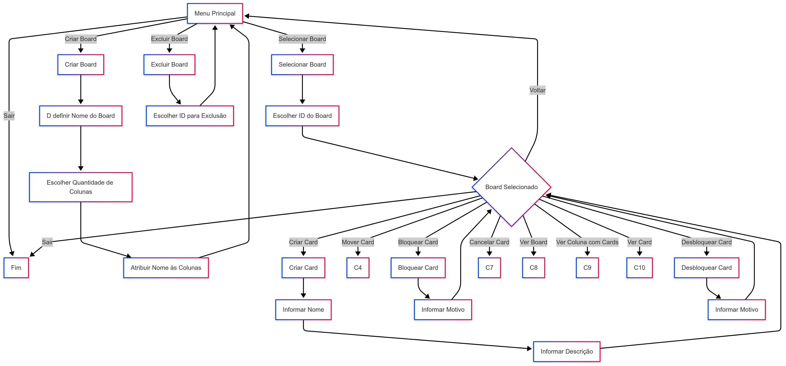

# Board de Tarefas com Java

[](https://www.oracle.com/java/)
[](https://maven.apache.org/)
[](https://www.mysql.com/)
[](LICENSE)

## Descrição

O **Board de Tarefas com Java** é um projeto desenvolvido como parte do desafio de código do **Bootcamp Decola Tech 2025**. O objetivo é criar um sistema de gerenciamento de tarefas baseado em um *board*, com armazenamento persistente em banco de dados. O projeto permite ao usuário criar múltiplos *boards*, associar *cards* de tarefas a eles e organizá-los em colunas personalizáveis, acompanhando o progresso das tarefas de forma prática e intuitiva.

Entre as funcionalidades principais, o usuário pode:
- Criar e gerenciar múltiplos *boards*.
- Adicionar *cards* de tarefas em colunas com nomes ou status personalizados (ex.: "Inicial", "Pendente", "Final", "Cancelado").
- Mover *cards* entre colunas para acompanhar a execução.
- Bloquear e desbloquear *cards*, registrando o motivo e o tempo em cada status.

O projeto foi desenvolvido com **Java 21**, utilizando **Maven** como gerenciador de dependências e **MySQL** como banco de dados, integrado via **JDBC**.



## Funcionalidades

- **Criação de Boards**: Crie boards personalizados com colunas específicas.
- **Gerenciamento de Cards**: Adicione, mova, bloqueie ou desbloqueie tarefas.
- **Colunas Customizáveis**: Defina nomes e ordens para as colunas de cada board.
- **Persistência**: Armazenamento de dados em MySQL para garantir que as informações sejam salvas.
- **Acompanhamento**: Veja o histórico de bloqueios e status das tarefas.

## Tecnologias Utilizadas

- **Java 21**: Linguagem principal do projeto.
- **Maven**: Gerenciamento de dependências e build.
- **MySQL**: Banco de dados relacional para armazenamento.
- **JDBC**: Integração entre Java e MySQL.
- **Lombok**: Redução de código boilerplate.


## Pré-requisitos

Para executar o projeto localmente, você precisará ter instalado:
- [Java 21 JDK](https://www.oracle.com/java/technologies/javase/jdk21-archive-downloads.html)
- [Maven](https://maven.apache.org/download.cgi)
- [MySQL](https://dev.mysql.com/downloads/mysql/) (versão 8.0 ou superior)
- Um editor ou IDE como IntelliJ IDEA ou Eclipse (opcional, mas recomendado).


1. **Clone o Repositório**:
   ```bash
   git clone https://github.com/seu-usuario/Board-de-Tarefas-Java.git
   cd Board-de-Tarefas-Java